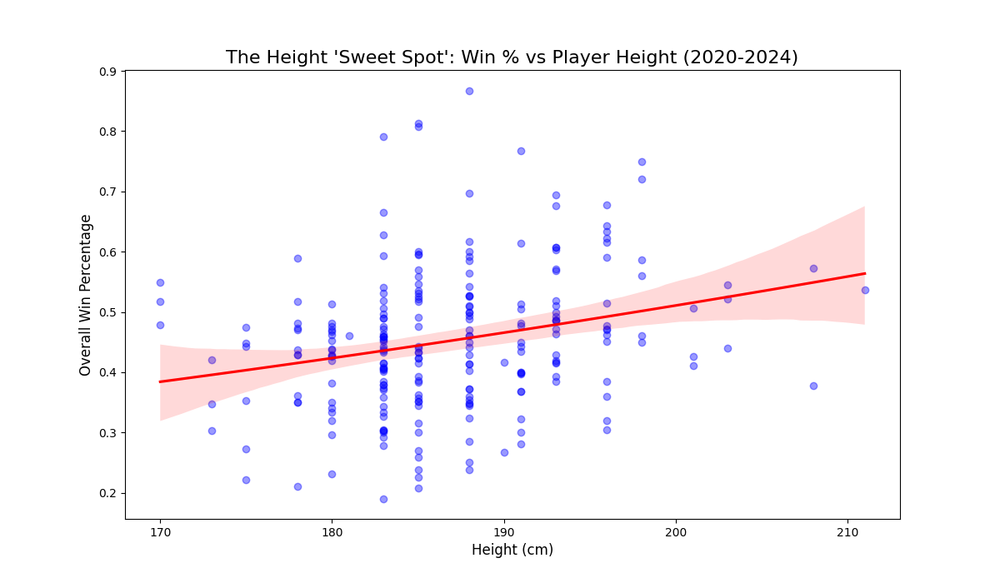
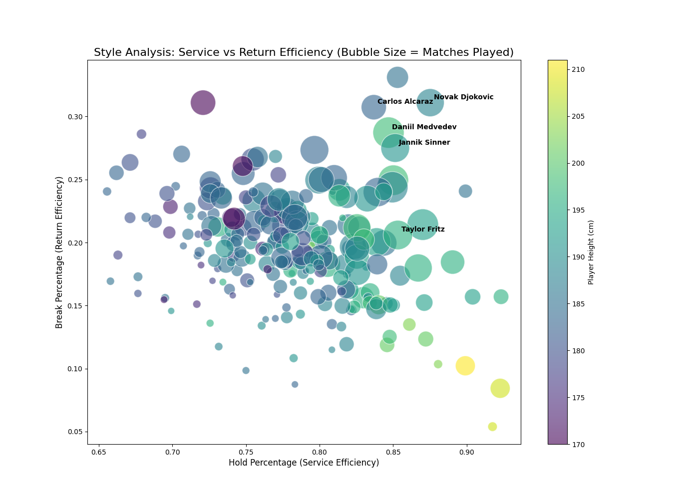
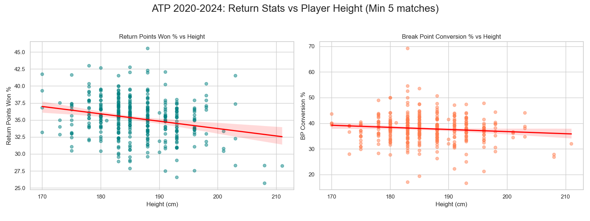
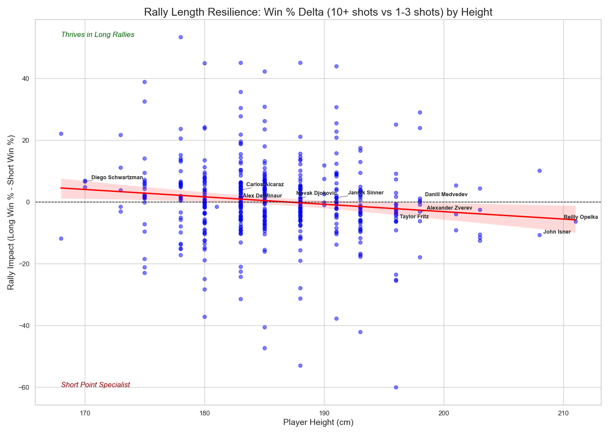
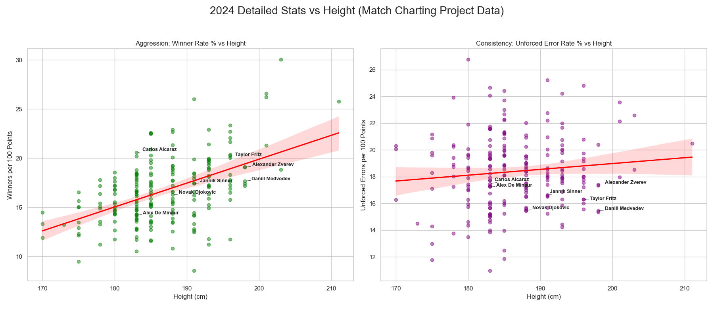
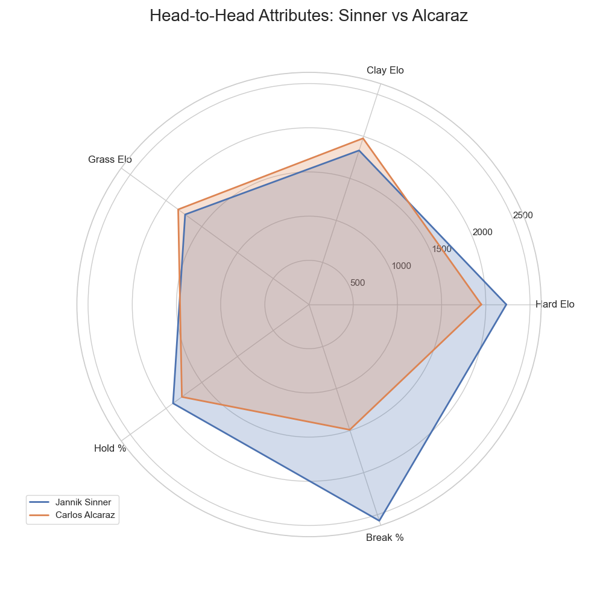

# The 190cm Sweet Spot: A Data-Driven Search for the Perfect Tennis Physique

In modern professional tennis, height is often talked about as the ultimate "cheat code." A 210cm player like Reilly Opelka or John Isner can hit serves that are physically impossible for a shorter player to return cleanly. But if height is such an advantage, why is the average height of the "Big Three" (Federer, Nadal, Djokovic) almost exactly **188cm (6'2")**?

Using 6 years of ATP match data (2019–2024) and detailed point-by-point stats from the *Match Charting Project*, we set out to find the "Ideal Height" for a modern tennis player.

---

## 1. The "Sweet Spot" Curve
When we plot every ATP player's height against their career win percentage and fit a polynomial regression curve, a fascinating pattern emerges.

The curve isn't a straight line up. Instead, it’s a parabola that peaks between **188cm and 193cm**. 
- **The Penalty of Being Small**: Below 180cm, players struggle to maintain a high enough hold percentage to compete with the elite.
- **The Diminishing Returns of Height**: Above 200cm, the win rate actually begins to **decline**. 

This suggests that there is a "Goldilocks Zone" where a player is tall enough to have a world-class serve, but not so tall that they lose the lateral quickness required for elite movement.

---

## 2. The Great Trade-off: Serve vs. Return
To understand *why* the win rate drops off for the giants, we mapped the entire tour on a **Style Efficiency Map**.

- **Bottom-Right (The Servebots)**: Taller players dominate here. They have massive "Hold Percentages" (often 90%+), but their "Break Percentage" is frequently below 15%. They win by surviving until a tiebreak.
- **Top-Left (The Scramblers)**: Shorter players (like Diego Schwartzman) thrive here. They break serve at elite rates but struggle to protect their own.
- **Top-Right (The All-Court Giants)**: This is where **Jannik Sinner**, **Carlos Alcaraz**, and **Novak Djokovic** live. They are all roughly 188cm-193cm. They have enough height to hold serve like a giant, but enough mobility to return like a scrambler.

### The Return Penalty: Why Giants Struggle to Break
If height is a gift on serve, it is a significant tax on the return. When we look specifically at return statistics across the tour, the data shows a clear downward trend.

As a player grows taller, their **Return Points Won %** and **Break Point Conversion %** tend to drop. There are two physical reasons for this "Return Penalty":
1.  **Center of Gravity**: Taller players have a higher center of gravity, making it physically slower to change direction and "dig out" low, fast serves.
2.  **Reaction Time**: Longer limbs take longer to coordinate. In a sport where a 200km/h serve reaches the returner in less than half a second, those extra milliseconds of limb movement are the difference between a clean return and a forced error.

This explains why the giants of the tour are often locked in tiebreaks—they are nearly impossible to break, but they also find it nearly impossible to break their opponents.

### The New Era: Defying the "Sweet Spot"
While our peak win-rate curve favors the 190cm range, a new generation of players is actively pushing that ceiling higher. Players like **Alexander Zverev (198cm)**, **Daniil Medvedev (198cm)**, **Hubert Hurkacz (196cm)**, and **Taylor Fritz (196cm)** represent a shift in the physics of the game.

- **Daniil Medvedev**: Perhaps the greatest outlier in tennis history. At 198cm, he should statistically be a "Servebot." Instead, he occupies the "Scrambler" quadrant of our Style Map, using his massive wingspan to return balls that would be out of reach for anyone else.
- **Alexander Zverev**: Combining a 220km/h serve with the lateral movement of a much shorter player, Zverev proves that 198cm is no longer a barrier to elite baseline rallying.
- **The "Serve+1" Specialists**: **Matteo Berrettini (196cm)** and **Stefanos Tsitsipas (193cm)** have optimized their games to end points in two shots, using their height to set up a dominant forehand.

These "Mobile Giants" are the reason the modern ATP tour feels faster and more serve-dominant than the era of Agassi or Sampras. They have neutralized the "Return Penalty" through better conditioning and specialized footwork.

---

## 3. The "Big Man" Fatigue: Rally Length Resilience
The data reveals that height is a liability as soon as the serve-return phase ends. We analyzed win rates based on rally length: **Short Points (1-3 shots)** vs. **Long Rallies (10+ shots)**.

As height increases, the "Rally Impact" becomes significantly more negative. For the 200cm+ giants, their win probability drops by nearly **10-15%** the moment a rally extends past 10 shots. 

The "All-Court Giants" like Sinner and Djokovic are the exceptions—they’ve engineered their games to maintain a positive rally impact despite their height, which is what separates them from the "Servebots."

---

## 4. Aggression vs. Consistency
Finally, we looked at the "Risk/Reward" profile of height using point-by-point winner and unforced error data.

Taller players hit significantly more winners per 100 points, but they also commit more unforced errors. The "Perfect Physique" is found in players who can maximize that winner rate without the error rate "climbing the cliff." 

---

## Conclusion: The New Archetype
The data is clear: the most successful tennis player in the world right now isn't the tallest or the fastest—it's the one who perfectly balances the two. 

The current world #1, **Jannik Sinner (192cm)**, represents the perfection of this archetype. He possesses the height of a dominant server but the statistical "DNA" of a 180cm return specialist.

### The Alcaraz Outlier: Power Below the Mean
While Sinner represents the peak of the 190cm "Sweet Spot," **Carlos Alcaraz (183cm)** is the ultimate outlier. At 183cm, Alcaraz is statistically on the "shorter" end of the tour, yet our data shows his winner rate matches that of the 200cm giants.

Alcaraz defies the height-winrate curve through **explosive acceleration**. While traditional players his height are often limited to "Scrambler" roles, Alcaraz uses his incredible foot speed to turn defensive positions into offensive winners. He represents a different solution to the physics of tennis: if you can't reach the ball with height, reach it with pure speed—and hit it harder than anyone else when you get there.

---

## Conclusion: Two Paths to the Throne
The data shows that there are currently two paths to the top of the ATP:
1.  **The Sinner Path**: The 190cm+ "Hybrid Giant" who has solved the movement problem.
2.  **The Alcaraz Path**: The 180cm+ "Explosive Outlier" who has solved the power problem.

As sports science continues to improve player movement, we may see the "Sweet Spot" shift slightly higher, but for now, the battle between the **192cm Sinner** and the **183cm Alcaraz** is a perfect live experiment in the physics of the sport.
